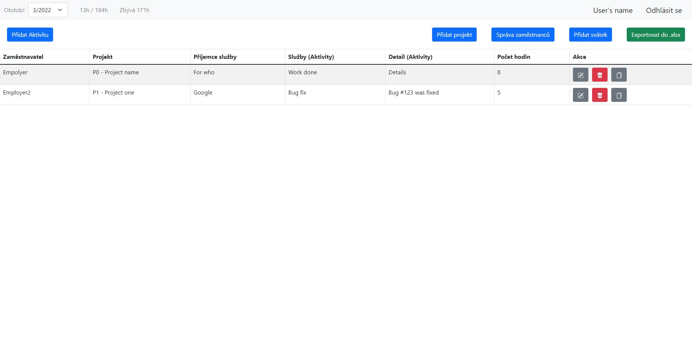

# Timesheet web-app

This app is used for tracking your work and how much you've worked on each project.
You can visit the site [here](https://timesheet.land.cz/login), however you won't be able to log in.

----

### Features
- see how many hours you've worked that month
- employers can download exported excel file
- employers can add and remove employees

### Technology
- [Java Spring Boot](https://spring.io/projects/spring-boot) for backend
- [Bootstrap](https://getbootstrap.com/) and Javascript for frontend
- [MySQL](https://www.mysql.com/) for database

### To do
- logging
- better bank holiday management
- darkmode

